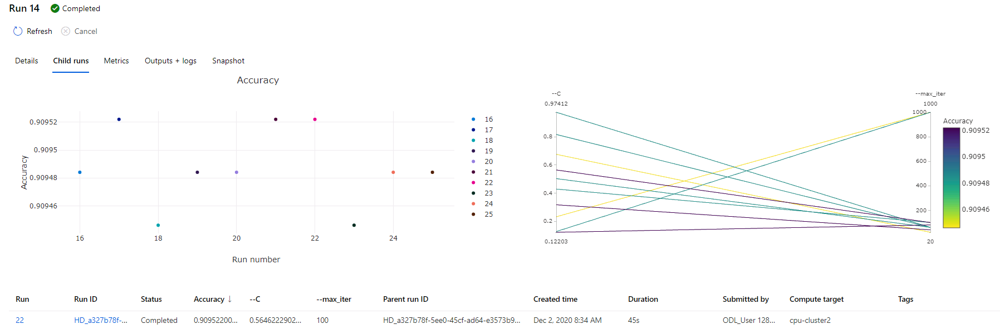
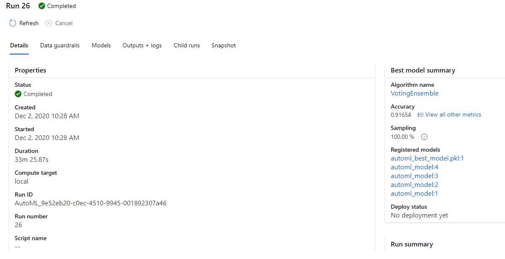
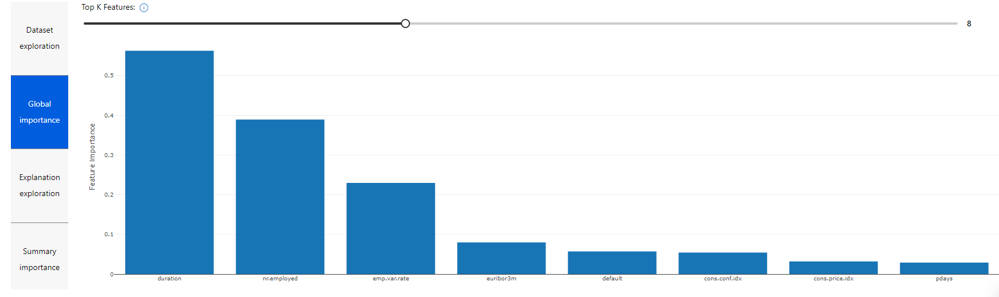

# Optimizing an ML Pipeline in Azure

## Overview
This project is part of the Udacity Azure ML Nanodegree.
In this project, we build and optimize an Azure ML pipeline using the Python SDK and a provided Scikit-learn model.
This model is then compared to an Azure AutoML run.

## Summary
**In 1-2 sentences, explain the problem statement: e.g "This dataset contains data about... we seek to predict..."**

This dataset contains data about bank customers with all the features we can use to make predictions. The goal is to predict if a customer is eligible for a loan. Thus, we have to deal with this problem with a classification algorithm, because we have to predict a discrete value that, in this case, admit two values (binary): eligible for a loan, or not eligible for a loan.

The feature we had in the dataset were: age, job, marital, education, default, housing, loan, contact, month, day_of_week, duration, campaign, pdays, previous, poutcome, emp.var.rate, cons.price.idx,cons.conf.idx, euribor3m, nr.employed, y (this last parameter contains the result of the prediction with a yes/no based on if the customer is considered eligible or not for a loan).

To solve this problem and provide the best prediction, we have taken advantage of **HyperDrive** to automatically tune the hyperparameters for a given algorithm. Then, we have taken advantage of **AutoML** and we have compared the outcomes of the two methods.

**In 1-2 sentences, explain the solution: e.g. "The best performing model was a ..."**

The best performing model in these experiments was the **VotingEnsemble** found by **AutoML** which reached an accuracy of **0.91654**

## Scikit-learn Pipeline
**Explain the pipeline architecture, including data, hyperparameter tuning, and classification algorithm.**

The Scikit-learn Pipeline implemented to find the best predictor for the customers elibigle to take a loan goes through the steps below:
* Get the dataset from the **CSV file** available [here](https://automlsamplenotebookdata.blob.core.windows.net/automl-sample-notebook-data/bankmarketing_train.csv).
* Clean data in the dataset and apply the **One Hot Encode** to transform data into numeric format so that they can be used in an algorithm.
* Split **train** and **test** data in two dataset following the classic rule 80:20 (80% for the training and 20% for the tests).
* Use the train dataset to feed the **LogisticRegression** algorithm (taking advantage of the Scikit-Learn library).
* Apply two hyperparameters to the **LogisticRegression**, that are:
  * **--C**: Inverse of the regularization strength. Smaller values cause stronger regularization [0.05, 1]
  * **--max_iter**: Maximum number of iterations to converge [20; 40; 60; 80; 100; 1000]
* Take advantage of **Hyperdrive** to automatically tune the hyperparmeters within the admitted ranges passed in inputs to the **LogisticRegression** to find the best predictor based on the **Accuracy** as a primary metric that we try to **maximize**.

Below is the best predictor found after completing the training phase described above, which was able to reach an accuracy of **0.90952** in **100 iterations** and with an inverse of the regularization strength of **0.56462**.

**What are the benefits of the parameter sampler you chose?**

The advantage of the **RandomParameterSampling** over the comprehensive and exhaustive **GridSampler** or **Bayesian Sampler** is that it allows to picking up random values from the hyperparameters dataset defined as an input. This allows to complete the training process earlier with a model performance that is comparable to the ones of the models calculated using the other sampler which take longer time to complete.

**What are the benefits of the early stopping policy you chose?**

The benefit of the early stopping is to shorten the time of the experiment. By setting the **evaluation_interval** to 1 and the **slack_factor** to 0.1, the training process can be concluded as soon as the primary metric exceeds the **slack factor** compared to the best performing run.

## AutoML
**In 1-2 sentences, describe the model and hyperparameters generated by AutoML.**

Thanks to the **AutoML** feature we can take advantage of an automatic system that does many of the taks that a Data Scientist has to do to perform a training process. These taks are usually time consuming and not strictly tied to the business. Thus, thanks to this tool we can focus on the real problem instead of spending precious time on polishing data, tuning the hyperparameters, etc.

The **AutoML** model has been configured using the parameters indicated below:
* **Timeout 30 seconds**: This timeout is critical to avoid running out of time within the free session we can use in the **AzureML** environment provided in the course, and make sure to complete the training process in that time window.
* **Classification Task**: Because we want to solve a Classification problem
* **Accuracy as a Primary Metric**: Because we identified the Accuracy as the metric to identify the best predictor and we want to compare the performance obtained using the **HyperDrive**.
* **2 Cross Validations**: Number of cross validations to perform
* **'y' as the Label Column Name**: To say that 'y' is the column that we want to predict the value of
* **Training Dataset**: This is the dataset to use during the training process

The final verdict of the **AutoML** tool is indicated below, and it shows that the best performing model is a **VotingEnsemble** that reached an **Accuracy** of **0.91654**:

Further, the final result also shows the importance of the features to make the prediction:

## Pipeline comparison
**Compare the two models and their performance. What are the differences in accuracy? In architecture? If there was a difference, why do you think there was one?**

The comparison between the best model found using the **HyperDrive** and the **AutoML** showed that the **AutoML** was able to find the best model in terms of **Accuracy** with a score of **0.91654** using a **VotingEnsemble** algorithm to solve this classification problem.

## Future work
**What are some areas of improvement for future experiments? Why might these improvements help the model?**

## Proof of cluster clean up
**If you did not delete your compute cluster in the code, please complete this section. Otherwise, delete this section.**
**Image of cluster marked for deletion**
