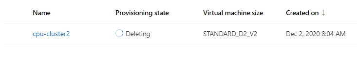

# Optimizing an ML Pipeline in Azure

## Overview
This project is part of the Udacity Azure ML Nanodegree.
In this project, we build and optimize an Azure ML pipeline using the Python SDK and a provided Scikit-learn model.
This model is then compared to an Azure AutoML run.

## Summary
**In 1-2 sentences, explain the problem statement: e.g "This dataset contains data about... we seek to predict..."**

This dataset contains data about bank customers with all the features we can use to make predictions. The goal is to predict if a customer is eligible for a loan. Thus, we have to deal with this problem with a classification algorithm, because we have to predict a discrete value that, in this case, admit two values (binary): eligible for a loan, or not eligible for a loan.

The feature we had in the dataset were: age, job, marital, education, default, housing, loan, contact, month, day_of_week, duration, campaign, pdays, previous, poutcome, emp.var.rate, cons.price.idx,cons.conf.idx, euribor3m, nr.employed, y (this last parameter contains the result of the prediction with a yes/no based on if the customer is considered eligible or not for a loan).

To solve this problem and provide the best prediction, we have taken advantage of **HyperDrive** to automatically tune the hyperparameters for a given algorithm. Then, we have taken advantage of **AutoML** and we have compared the outcomes of the two methods.

**In 1-2 sentences, explain the solution: e.g. "The best performing model was a ..."**

The best performing model in these experiments was the **VotingEnsemble** found by **AutoML** which reached an accuracy of **0.91654**

## Scikit-learn Pipeline
**Explain the pipeline architecture, including data, hyperparameter tuning, and classification algorithm.**

The **Scikit-learn Pipeline** has been implemented by taking advantage of the **Jupyter Notebook** and the **Python SDK library**.

The first thing the pipeline does is to get a reference to the **Workspace**. Using the **Workspace** we can create a **Compute Cluster** programmatically with the attributes below that is used to run the **HiperDrive** configuration:

* vm_size='STANDARD_D2_V2'
* max_nodes=4

Data about bank marketing is imported using a ```TabularDatasetFactory``` a **CSV file** available [here](https://automlsamplenotebookdata.blob.core.windows.net/automl-sample-notebook-data/bankmarketing_train.csv). The dataset contains the following features: *age, job, marital, education, default, housing, loan, contact, month, day_of_week, duration, campaign, pdays, previous, poutcome, emp.var.rate, cons.price.idx,cons.conf.idx, euribor3m, nr.employed, y (this last parameter contains the result of the prediction with a yes/no based on if the customer is considered eligible or not for a loan)*.

The training phase of the pipeline takes advantage of the **SKLearn Estimator** that uses the **train.py** script which uses a **LogisticRegression**, that is an algorithm tipically used in binary classification problems like the one we are studying in this experiment. 

```
est = SKLearn(source_directory=script_folder, compute_target=cpu_cluster, entry_script="train.py")
```

In particular, the **train.py** script does what follows:

* **Clean data** in the dataset and apply the **One Hot Encode** to transform data into numeric format so that they can be used in an algorithm.
 * Split **train** and **test** data in two dataset following the classic rule 80:20 (80% for the training and 20% for the tests). This is a critical step because the dataset used to train the model shouldn't be used to test the model, or the risk is to think that the model has good performance while isntead it just work well on that particular data used to train it.
 * Use the train dataset to feed the **LogisticRegression** algorithm (taking advantage of the Scikit-Learn library).
 * Apply two hyperparameters to the **LogisticRegression**, that are:
   * **--C**: Inverse of the regularization strength. Smaller values cause stronger regularization
   * **--max_iter**: Maximum number of iterations to converge

The two hyperparameters passed to the **LogisticRegressions** (see above) can be tweaked to perform more trainings and compare the results to find the best combination to calculate the best predictor. This is a time consuming process, and it's where the **HyperDrive** comes to rescue. In fact, we could end up having to test many and many different combinations of the hyperparameters manually. while the **HyperDrive** helps us to automate this process, and that's what I did. **Hyperdrive**  automatically tune the hyperparmeters within the admitted ranges passed in inputs to the **LogisticRegression** to find the best predictor based on the **Accuracy** as a primary metric that we try to **maximize**.

First thing first, I had to choose a **sampler** to select the values of the hypermarameters to test. In this case, I've opted for a **RandomParameterSampling** which picks up values randomly in the set provided as an inputm. The benefit is that it doesn't use **all** the values within the ranges, and complete the job pretty quickly:

```
ps = RandomParameterSampling({
    "--C": uniform(0.05, 1),
    "--max_iter": choice(20, 40, 60, 80, 100, 1000)
    }
)
```

* **C**: Inverse of the regularization strength. Smaller values cause stronger regularization. Considering that it has to be greater than 0, the uniform range between between 0.05 and 1 has been selected to verify how the model improves with lower values of C.
* **max_iter**: Maximum number of iterations to converge. This parameter has been set to limit the time of the experiment, and see if makeing it longer helps to improve the performance.

The **HyperDrive** has been configured to run as follows:

```
hyperdrive_config = HyperDriveConfig(estimator=est, policy=policy, hyperparameter_sampling=ps, 
    primary_metric_name='Accuracy', primary_metric_goal=PrimaryMetricGoal.MAXIMIZE, max_total_runs=10, max_concurrent_runs=2)
```

As shown above, the **HyperDrive** uses the **SKLearn estimator**, a termination policy to avoid running for too long (below you can read the advantage of adopting an **early stopping policy**), a **parameter sampler** (I opted for a **RandomParameterSampling** - see above), a **primary metric** set to **Accuracy** because number of correct predictions on total predictions can be a good index to assess the performance of the model. The goal is to **maximize** the primary metric, because the higher the accuracy, the better. finally, I've set the **max concurrent nodes** to 2, to avoid exceeding the capabilities of the **compute cluster**, and the **max total runs** to 10 to avoid exceeding the time constraints.

The **HyperDrive** performed 10 trainings with different combinations of the hyperparameters picked up randomly in the hyperparameter search space. The best predictor found after completing the training phase described above was able to reach an accuracy of **0.90952** in **100 iterations** and with an inverse of the regularization strength of **0.56462**.


**What are the benefits of the parameter sampler you chose?**

```
# Specify a Policy
policy = BanditPolicy(evaluation_interval=1, slack_factor=0.1)
```

The parameters used to configure the **BanditPolicy** are:

* **slack_factor**: the slack allowed with respect to the best performing training run. slack_factor specifies the allowable slack as a ratio. slack_amount specifies the allowable slack as an absolute amount, instead of a ratio.
* **evaluation_interval**: the frequency for applying the policy


The advantage of the **RandomParameterSampling** over the comprehensive and exhaustive **GridSampler** or **Bayesian Sampler** is that it allows to picking up random values from the hyperparameters search space defined as an input. This allows to complete the training process earlier with a model performance that is comparable to the ones of the models calculated using the other sampler which take longer time to complete. In fact, the training phase is terminated when the **primary metric** is not within the **slack_factor** compared to the best performing run.

**What are the benefits of the early stopping policy you chose?**

The benefit of the early stopping is to shorten the time of the experiment. By setting the **evaluation_interval** to 1 and the **slack_factor** to 0.1, the training process can be concluded as soon as the primary metric exceeds the **slack factor** compared to the best performing run. The **evaluation interval** is set to 1, and it means that the policy is applied at each cycle to shorten the time of the training phase even more. Number at hands, the stopping policy will terminates any run that has the best metric lower than ```(1/(1+0.1))=91%``` compared to the best performing run.

## AutoML
**In 1-2 sentences, describe the model and hyperparameters generated by AutoML.**

Thanks to the **AutoML** feature we can take advantage of an automatic system that does many of the taks that a Data Scientist has to do to perform a training process. These taks are usually time consuming and not strictly tied to the business. Thus, thanks to this tool we can focus on the real problem instead of spending precious time on polishing data, tuning the hyperparameters, etc.

The **AutoML** model has been configured using the parameters indicated below:
* **Timeout 30 seconds**: This timeout is critical to avoid running out of time within the free session we can use in the **AzureML** environment provided in the course, and make sure to complete the training process in that time window.
* **Classification Task**: Because we want to solve a Classification problem
* **Accuracy as a Primary Metric**: Because we identified the Accuracy as the metric to identify the best predictor and we want to compare the performance obtained using the **HyperDrive**.
* **2 Cross Validations**: Number of cross validations to perform
* **'y' as the Label Column Name**: To say that 'y' is the column that we want to predict the value of
* **Training Dataset**: This is the dataset to use during the training process

The final verdict of the **AutoML** tool is indicated below, and it shows that the best performing model is a **VotingEnsemble** that reached an **Accuracy** of **0.91654**:


Further, the final result also shows the importance of the features to make the prediction:


## Pipeline comparison
**Compare the two models and their performance. What are the differences in accuracy? In architecture? If there was a difference, why do you think there was one?**

The comparison between the best model found using the **HyperDrive** and the **AutoML** showed that the **AutoML** was able to find the best model in terms of **Accuracy** with a score of **0.91654** using a **VotingEnsemble** algorithm to solve this classification problem versus a **0.90952** obtained using the **LogisticRegression** using the **HyperDrive** tool.

The **AutoML** was able to find the best predictor because it tries many different algorithms instead of using just one algorithm and tune the hyperparameters. However, it's important to note that there's not a big difference between the best accuracy obtained using **Azure Hyperdrive** and **AutoML**. Despite this, though, the **AutoML** was way more easy to configure and it took almost no effort to put up the environment and test many and many different algorithms in a short period of time. 


## Future work
**What are some areas of improvement for future experiments? Why might these improvements help the model?**

We could remove the **early stopping** policy to see if we can improve the accuracy using the **HyperDrive** pipeline. We could also increase the maximum number of iterations to see if it helps to increase the performance of the model. As for the **AutoML** pipeline, we could increase the number of **cross validations** to a typical value that is between 5 and 10 and see if it helps to improve the performance, considering that in this experiment we have set it to 2 to speed up the training process.

## Proof of cluster clean up
**If you did not delete your compute cluster in the code, please complete this section. Otherwise, delete this section.**
**Image of cluster marked for deletion**

At the end of the pipeline the computer cluster is deleted.



